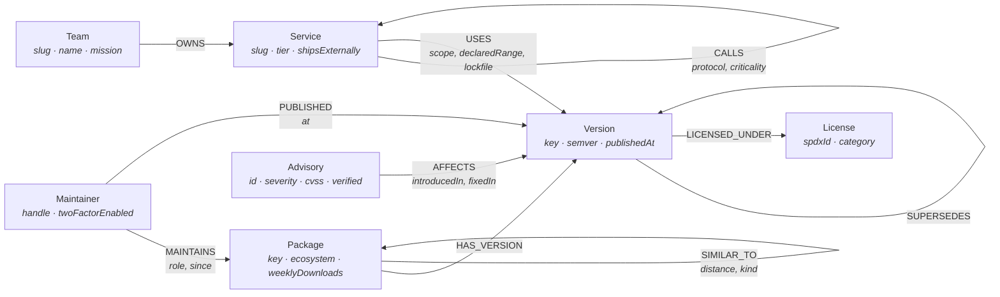
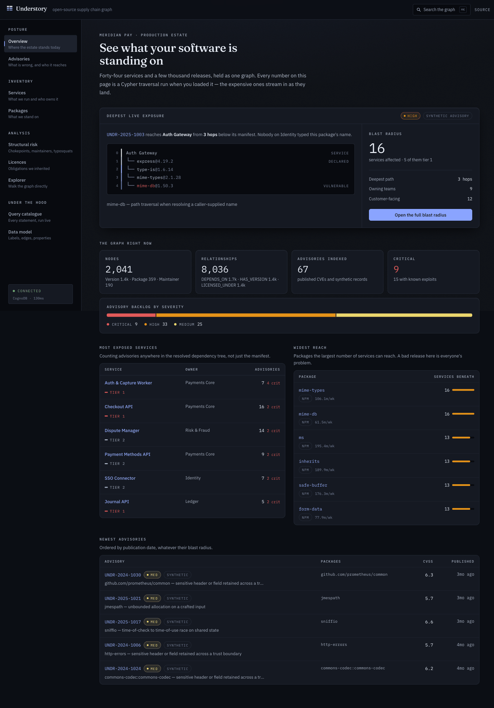
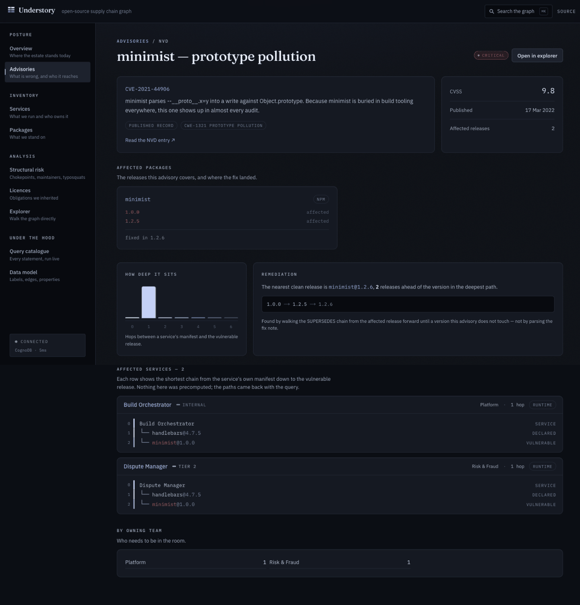
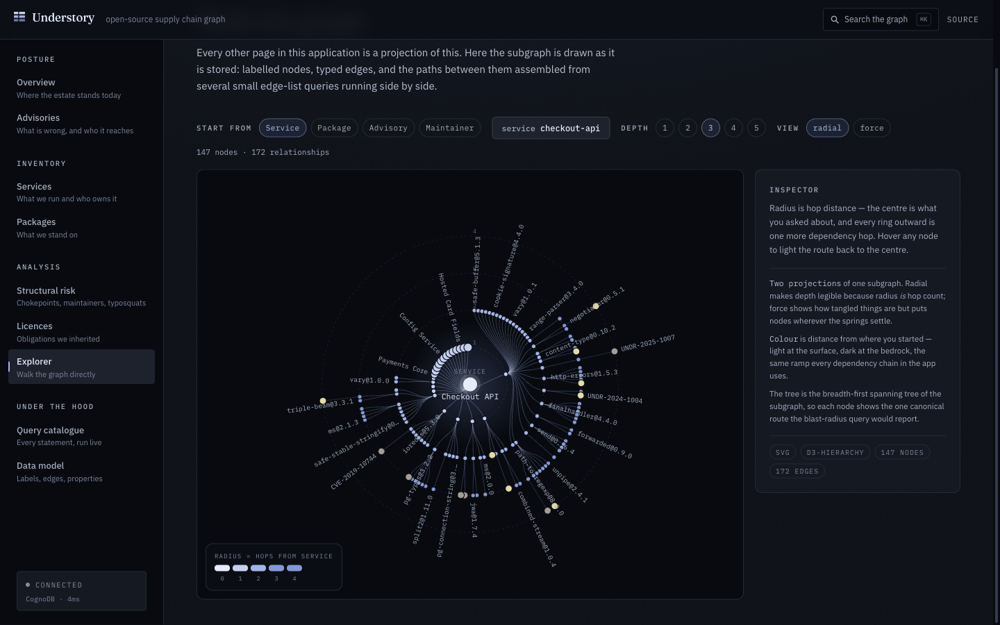
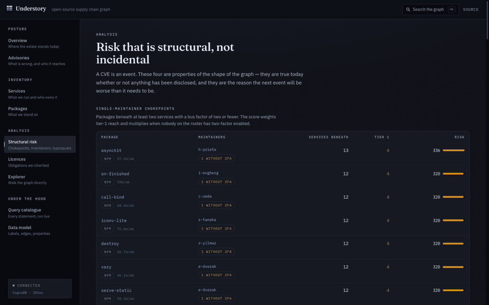
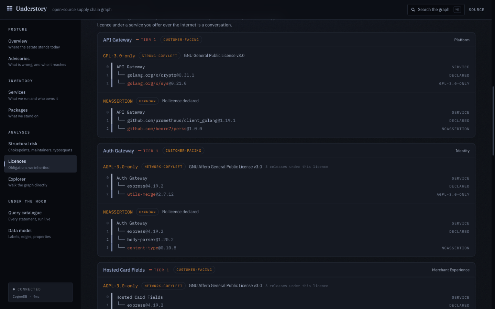
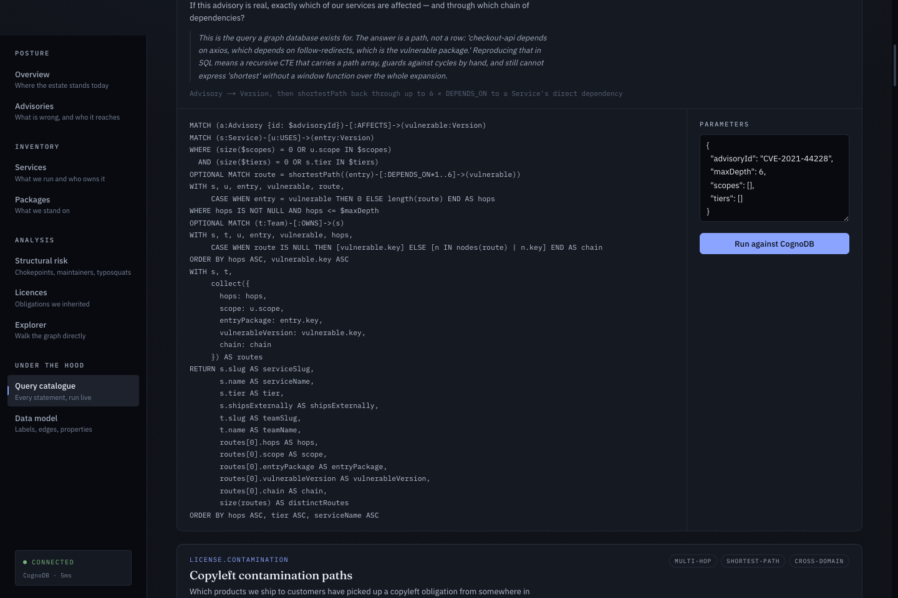

<div align="center">

# Understory

**See what your software is standing on.**

An open-source supply chain risk console backed by a graph database.
Built for the Wexa AI take-home, on [CognoDB](https://console.cognodb.com) over Bolt + openCypher.

[Live demo](#) · [Screen recording](#) · [Why a graph database?](#why-a-graph-database) · [Data model](#data-model) · [The queries](#the-queries-that-matter)

</div>

---

## The problem

At 09:00 on a Tuesday a critical CVE lands on a package nobody at your company has heard of. Four questions decide how the next six hours go:

1. **Which of our services are actually affected** — not "which manifests mention it", but which services can reach it through any depth of transitive dependency?
2. **Through which chain?** An engineer cannot act on "you are affected." They can act on `checkout-api → express → body-parser → qs → side-channel`.
3. **Who owns the fix, and what is the nearest release that is clean?**
4. **Why did this reach so far in the first place?** Which packages are single-maintainer chokepoints sitting underneath half the estate?

Every one of those is a question about _connections_, and every one of them is answered here by a single Cypher traversal.

**Understory** indexes a fictional payments company's estate — 44 services, 359 packages across five registries, 1,331 releases, 190 maintainers, 67 advisories — as one graph, and makes those four questions answerable by a non-technical person in a few clicks.

> **A note on the data.** The organisation is invented. The **packages, their dependency trees and 37 of the advisories are real** — `express` really does pull in thirty-one packages, and `qs → side-channel → get-intrinsic → hasown → function-bind` is a real chain you can find in your own `node_modules`. The remaining 30 advisories are clearly marked `synthetic` everywhere they appear in the UI. See [Data provenance](#data-provenance).

---

## Why a graph database?

The use case was chosen because a relational schema does not merely make it slower — it makes it _awkward_, and the awkwardness lands in exactly the places that matter.

### 1. The answer is a path, not a row

"Which services does CVE-2021-44228 affect?" is reachability over a variable-depth DAG. In SQL that is a recursive CTE. But the deliverable is not the _set_ of affected services — it is the **chain** for each one, because that is what an engineer has to change. A recursive CTE can be made to carry a path array, but you are then hand-rolling cycle detection, hand-rolling "shortest", and materialising an intermediate result set orders of magnitude larger than the answer.

In Cypher it is the query, and the path comes back for free:

```cypher
MATCH (a:Advisory {id: $advisoryId})-[:AFFECTS]->(vulnerable:Version)
MATCH (s:Service)-[u:USES]->(entry:Version)
MATCH route = shortestPath((entry)-[:DEPENDS_ON*0..6]->(vulnerable))
RETURN s.name, [n IN nodes(route) | n.key] AS chain
```

### 2. Depth is the finding

A relational model naturally answers "does this service depend on X?" A graph answers "**how far down** does this service depend on X?" — and the distance is the interesting part. A vulnerable package one hop away is in your lockfile and someone chose it. Four hops away, nobody at the company has ever typed its name. The dashboard leads with the deepest live exposure for exactly this reason.

### 3. Cross-domain questions cost one pattern, not four joins

The licence contamination query crosses three otherwise unrelated concerns — licensing, variable-depth dependency, ownership — and returns the offending chain:

```cypher
MATCH (l:License)<-[:LICENSED_UNDER]-(obligated:Version)
WHERE l.category IN $categories
MATCH (s:Service)-[:USES]->(entry:Version)
WHERE s.shipsExternally = true
MATCH route = shortestPath((entry)-[:DEPENDS_ON*0..6]->(obligated))
OPTIONAL MATCH (t:Team)-[:OWNS]->(s)
RETURN s.name, t.name, l.spdxId, [n IN nodes(route) | n.key] AS chain
```

Relationally: a recursive CTE, joined to licences, joined to services, joined to teams, plus a hand-written path accumulator and cycle guard.

### 4. Composing two different traversals

The **inherited exposure** query walks the _service call graph_ and the _dependency graph_ in one statement, and returns where they meet — a tier-1 service that is clean in its own tree but calls something that is not. Two independent recursive expansions, joined at their far ends. This is the query that is genuinely hard to write relationally, and it is nine lines here.

### 5. Reverse reachability is free

"Which services would notice if this package broke?" is the same edge read backwards. A graph pays nothing extra for it; a relational index does.

### 6. The model is heterogeneous and sparse

Seven labels, eleven relationship types, five package ecosystems in one index. Adding `SIMILAR_TO` for typosquat adjacency, or `PUBLISHED` to model who actually pushed each release, cost one pattern each — no migration, no nullable columns, no fifth ecosystem table.

**Where a relational database would win:** aggregate reporting over flat facts ("total downloads by ecosystem per month"), and anything transactional. This application does neither.

---

## Data model



### The one decision that matters

**Dependencies are edges between `Version` nodes, not between `Package` nodes.** That is what makes every depth number in the application trustworthy: two services can depend on the same package and have completely different transitive trees because they resolved different releases. Modelling it at the package level would collapse that distinction and quietly make every blast-radius answer wrong.

### Live census

| Label        |     Count |     | Relationship                                         |     Count |
| ------------ | --------: | --- | ---------------------------------------------------- | --------: |
| `Version`    |     1,331 |     | `DEPENDS_ON`                                         |     1,563 |
| `Package`    |       359 |     | `HAS_VERSION`                                        |     1,331 |
| `Maintainer` |       190 |     | `PUBLISHED`                                          |     1,331 |
| `Advisory`   |        67 |     | `LICENSED_UNDER`                                     |     1,331 |
| `Service`    |        44 |     | `SUPERSEDES`                                         |       972 |
| `License`    |        17 |     | `MAINTAINS`                                          |       756 |
| `Team`       |        10 |     | `USES` · `CALLS` · `OWNS` · `AFFECTS` · `SIMILAR_TO` |       507 |
| **Total**    | **2,018** |     | **Total**                                            | **7,791** |

Comfortably inside the free (c0) tier's 1 GB disk and 256 MB RAM. The `/model` page renders these counts live from the database.

---

## The queries that matter

The full catalogue is browsable and **runnable against the live database** at `/queries`. The statements below are the ones that make the case.

| Query                            | What it answers                                                                    | Why it is a graph query                                                                                                            |
| -------------------------------- | ---------------------------------------------------------------------------------- | ---------------------------------------------------------------------------------------------------------------------------------- |
| **`advisory.blastRadius`**       | Which services this CVE reaches, through which chain, at what depth, owned by whom | Variable-depth reachability that returns the _path_; `shortestPath` picks one clean explanation per service instead of every route |
| **`license.contamination`**      | Which shipped products picked up a copyleft obligation, and via which chain        | Three unrelated domains joined by a variable-depth traversal                                                                       |
| **`risk.inheritedExposure`**     | Tier-1 services that are clean themselves but call something that is not           | Two independent recursive expansions composed in one statement                                                                     |
| **`risk.chokepoints`**           | Single-maintainer packages sitting under a lot of the estate                       | Two independent graph facts — maintainer count, and a reachability set that does not exist until you traverse for it               |
| **`risk.maintainerBlastRadius`** | If this registry account were compromised, how much could one release reach        | Five relationship types in one walk: person → package → release → closure → service                                                |
| **`advisory.upgradePath`**       | The nearest release that is not affected, and how many releases ahead              | Shortest path over `SUPERSEDES` with a negative pattern predicate                                                                  |
| **`package.downstreamServices`** | Which of our services stand on this package                                        | Reverse reachability — the same edge, read backwards                                                                               |
| **`risk.typosquats`**            | Registry entries one keystroke from something we depend on                         | Name similarity stored as an edge, so a two-hop walk instead of a quadratic self-join with an edit-distance predicate              |

### Parameterisation

Every statement is a **frozen constant** in [`src/lib/queries/catalog/`](src/lib/queries/catalog/). Nothing else in the codebase writes Cypher. Values reach the database through the driver's parameter channel — never by concatenation.

Filters are parameters too:

```cypher
WHERE (size($severities) = 0 OR a.severity IN $severities)
  AND ($search = '' OR toLower(a.id) CONTAINS toLower($search))
```

One statement serves every combination of filters, so the query plan is reusable and there is no code path anywhere that builds Cypher from user input.

Each catalogue entry carries a Zod schema for its parameters, and [`runQuery`](src/lib/queries/run.ts) is the single choke point that validates them and normalises Bolt's wire types on the way back.

---

## Screenshots

|                                                                                                                                                         |                                                                                                                                                  |
| ------------------------------------------------------------------------------------------------------------------------------------------------------- | ------------------------------------------------------------------------------------------------------------------------------------------------ |
|  **Overview** — leads with the deepest live exposure, rendered as a soil-profile chain                        |  **Blast radius** — every affected service, its chain, its owner, and the nearest safe upgrade |
|  **Explorer** — the subgraph as stored, assembled from several small edge-list queries                        |  **Structural risk** — chokepoints, maintainer blast radius, typosquat adjacency, inherited exposure           |
|  **Licences** — copyleft obligations that reached a customer-facing service, with the chain that carried them |  **Query catalogue** — every statement, its reasoning, and a button to run it live                       |

---

## Running it

### 1. Create a CognoDB instance

1. Sign up at **[console.cognodb.com/signup](https://console.cognodb.com/signup)** — the free tier needs no card.
2. Create a free **c0** instance and pick a region. It provisions in under a minute.
3. Copy the connection URI (`bolt+s://<instance-id>.databases.cognodb.com`) and the generated password for the user `cognodb`. **The password is shown exactly once.**

### 2. Configure

```bash
git clone https://github.com/garvbahl37-gif/understory.git
cd understory
npm install
cp .env.example .env.local
```

Fill in `.env.local`:

```dotenv
COGNODB_URI=bolt+s://<instance-id>.databases.cognodb.com
COGNODB_USER=cognodb
COGNODB_PASSWORD=<the password shown at instance creation>
```

`.env*` is git-ignored (with an exception for `.env.example`). Nothing reads a credential from anywhere but the environment.

### 3. Load the graph

```bash
npm run seed          # idempotent — MERGE everywhere, safe to re-run
npm run seed:reset    # wipe first, then load
npm run seed -- --dry-run   # build the dataset and print it, touch nothing
npm run seed:inspect  # census + reachability diagnostics, no database needed
```

The loader creates seven uniqueness constraints and six indexes, then loads nodes and relationships in batches of 400 with a progress bar. It takes about a minute against a free instance.

### 4. Verify

```bash
npm run verify
```

Runs **every statement in the catalogue** against the live instance, resolving real entity ids first, and reports rows and timings per query. This is the closest thing a query layer has to a test suite — it proves each statement parses, that the parameters the app sends satisfy each schema, and that the traversals return something.

### 5. Run

```bash
npm run dev     # http://localhost:3000
npm run build && npm start
```

| Script                 | What it does                                         |
| ---------------------- | ---------------------------------------------------- |
| `npm run dev`          | Development server                                   |
| `npm run build`        | Production build                                     |
| `npm run seed`         | Load the graph (idempotent)                          |
| `npm run seed:reset`   | Wipe, then load                                      |
| `npm run seed:inspect` | Dataset census + reachability check, offline         |
| `npm run verify`       | Run every catalogued query against the live database |
| `npm run typecheck`    | `tsc --noEmit`                                       |
| `npm run lint`         | ESLint                                               |
| `npm run format`       | Prettier                                             |

---

## Architecture

```
src/
├── app/
│   ├── page.tsx                  Overview — the thesis, then the numbers
│   ├── advisories/[id]/          Blast radius (the flagship view)
│   ├── services/[slug]/          Ownership, footprint, exposure depth
│   ├── packages/[key]/           Releases, maintainers, reverse reachability
│   ├── risk/                     Chokepoints · maintainers · typosquats · inherited
│   ├── licences/                 Contamination paths
│   ├── explorer/                 Interactive canvas force layout
│   ├── queries/                  The catalogue, runnable live
│   ├── model/                    Labels, edges, properties, provenance
│   ├── health/                   Live connectivity + how the driver is configured
│   └── api/                      health · search · graph · query/[id]
│
├── lib/
│   ├── db/
│   │   ├── config.ts             Zod-validated env; returns a result, never throws
│   │   ├── driver.ts             Driver singleton, pool sizing, read/write helpers
│   │   ├── errors.ts             Six-kind error taxonomy + remediation copy
│   │   └── serialize.ts          Bolt wire types → JSON, in exactly one place
│   ├── queries/
│   │   ├── registry.ts           The QueryDefinition contract
│   │   ├── catalog/              Every Cypher statement, by area
│   │   ├── run.ts                Validate params → execute → normalise
│   │   ├── load.ts               Server-component loader that returns typed failures
│   │   └── graph.ts              Assembles explorer subgraphs from edge-list fragments
│   ├── domain/types.ts           Labels, relationship types, row shapes
│   └── format.ts                 Key parsing, number/date formatting, colour ramps
│
├── components/
│   ├── layout/                   Masthead · rail · ⌘K search · live health pill
│   ├── ui/                       Primitives · Strata · charts · filters · states
│   └── graph/ForceGraph.tsx      Canvas + d3-force, pan/zoom/drag, hover inspector
│
├── seed/
│   ├── data/                     Package universe, advisories, org, licences
│   ├── generate.ts               Deterministic dataset from one seed constant
│   ├── seed.ts                   Batched, idempotent loader
│   └── inspect.ts                Offline census + reachability diagnostics
│
└── scripts/verify-queries.ts     Runs the whole catalogue against the live database
```

### Engineering decisions worth defending

**One driver per process.** A Bolt driver owns a connection pool and is meant to be long-lived, so it lives on `globalThis` to survive HMR in development and isolate reuse on a serverless platform. Idle sockets are pinged before reuse, because a proxy will happily drop a connection the pool still believes in.

**A pool sized for the free tier.** c0 allows 200 connections in total, and a serverless platform will start more isolates than that if you let it. Each instance caps its pool at twelve with a ten-second acquisition timeout, so a cold-start burst degrades into slower requests instead of a connection storm.

**Failures are typed, not thrown.** Driver errors are normalised into six kinds — `not_configured`, `unreachable`, `unauthorized`, `timeout`, `query`, `unknown` — each with remediation copy. Server components load through a helper that returns `{ ok: false, error }` rather than throwing, so an unreachable database renders a sentence and a retry button instead of a 500. `/api/health` returns 503 when the database is down, so an uptime monitor can point straight at it. **You can test this by breaking `COGNODB_PASSWORD` and reloading any page.**

**The console cannot run arbitrary Cypher.** `/api/query/[id]` takes a statement _id_, not a query, looks it up in the frozen catalogue, and validates the body against that statement's own schema before the driver sees it. Read-only, allowlisted, and structurally incapable of writing.

**Variable-length bounds are literals; depth is a parameter.** openCypher does not allow `[:R*1..$n]`. Rather than building the statement as a string, the pattern uses a generous literal bound and the caller's depth is applied as `WHERE length(route) <= $maxDepth`. One constant statement, a real parameter, no concatenation.

**The dataset is a pure function of one seed.** `generate.ts` uses a seeded PRNG with no `Date.now()` or `Math.random()`, so two people running the loader get byte-identical graphs and the screenshots above stay reproducible. A final repair pass guarantees every advisory whose package something depends on is demonstrably exposed — while deliberately leaving one advisory unreachable, so the "you are not exposed to this" empty state is real.

---

## Design

The palette is a **soil profile**, because that is what the data is: your service at the surface, the package that is on fire five strata below it.

- **Ground** is warm peat rather than the usual blue-black, with a fine grain overlay so it reads as material rather than plastic.
- **Depth** is encoded as an ochre ramp. Every dependency path in the application is drawn as an indented monospace tree with a soil-profile gutter — the notation engineers already read in `npm ls`, made legible at a glance to someone who has never seen a lockfile.
- **Chalk blue** is the only cool colour in the system and is reserved for things you can act on.
- **Severity** is a separate, reserved status channel. The four steps were tuned with a colour-vision validator, not by eye: the worst adjacent pair separates by ΔE 12.8 under deuteranopia and 16.4 under normal vision, severity is _additionally_ encoded by lightness, and every severity mark ships with its label — colour alone never carries the meaning.
- **Type** is Fraunces for the name and section titles, IBM Plex Sans for the interface, IBM Plex Mono for every identifier, version and number.

Every text colour in the system clears 4.5:1 against all three surfaces; the deep strata colours are used only for 3px bands that carry no text. Loading, empty and error states are designed rather than defaulted, filters live in the URL so every view is shareable, focus is always visible, and `prefers-reduced-motion` is respected — including by the force layout, which runs to completion in one tick rather than animating.

---

## Data provenance

Being precise about this matters more than looking impressive.

|                  | Source                                                                                                                                                                                          |
| ---------------- | ----------------------------------------------------------------------------------------------------------------------------------------------------------------------------------------------- |
| ✅ **Real**      | Package names, registries, descriptions, and the dependency edges between them across npm, PyPI, Maven Central, crates.io and Go modules                                                        |
| ✅ **Real**      | 37 published advisories with their true affected packages and fix boundaries — Log4Shell, Text4Shell, Spring4Shell, the lodash prototype-pollution family, the urllib3 redirect leaks, Terrapin |
| ✅ **Real**      | Current released versions for ~200 recognisable packages, used to anchor each release history                                                                                                   |
| ⚠️ **Synthetic** | Meridian Pay — every team, service, manifest and call edge                                                                                                                                      |
| ⚠️ **Synthetic** | All maintainer identities. No real person is described here as having weak security hygiene                                                                                                     |
| ⚠️ **Synthetic** | 30 additional advisories (`UNDR-*`), aimed at deep transitive leaves to give the graph realistic density. Marked `verified: false` and labelled **synthetic** everywhere they appear            |
| ⚠️ **Synthetic** | Intermediate version numbers, weekly download figures, and the `SIMILAR_TO` typosquat pairs                                                                                                     |

CVSS scores for the real advisories are the commonly cited v3.1 base scores; treat the NVD entry (linked from every real advisory page) as authoritative rather than this repository.

---

## Tech

Next.js 16 (App Router, React 19) · TypeScript strict · Tailwind CSS v4 · **`neo4j-driver` 6** over Bolt to CognoDB · Zod · d3-force · deployed on Vercel.

The official Neo4j driver is used unchanged — CognoDB speaks Bolt 5.x and openCypher, so pointing the driver at a `bolt+s://` URI was the entire integration.

---

<div align="center">
<sub>Built for the Wexa AI take-home assignment.</sub>
</div>
